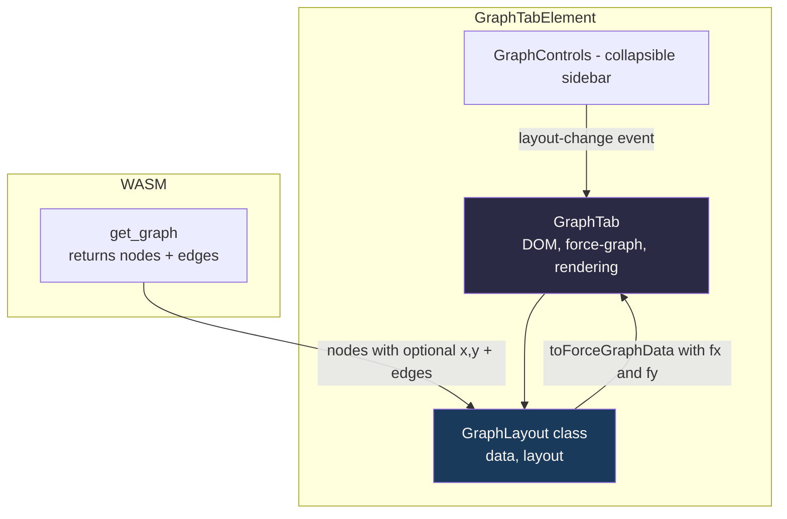
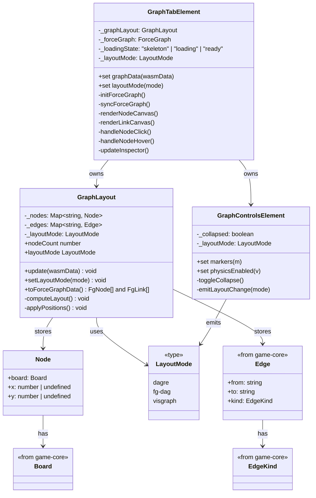
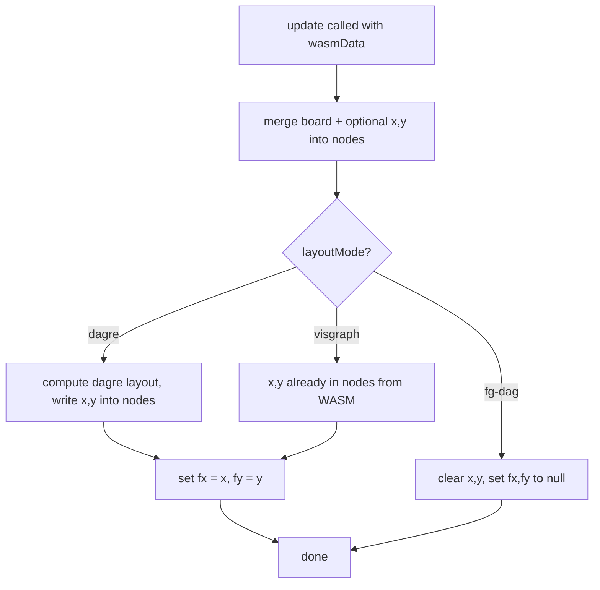
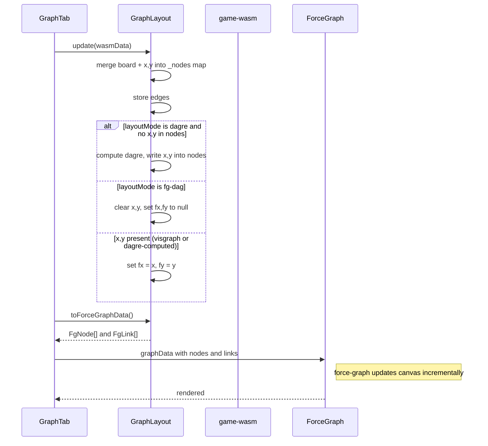
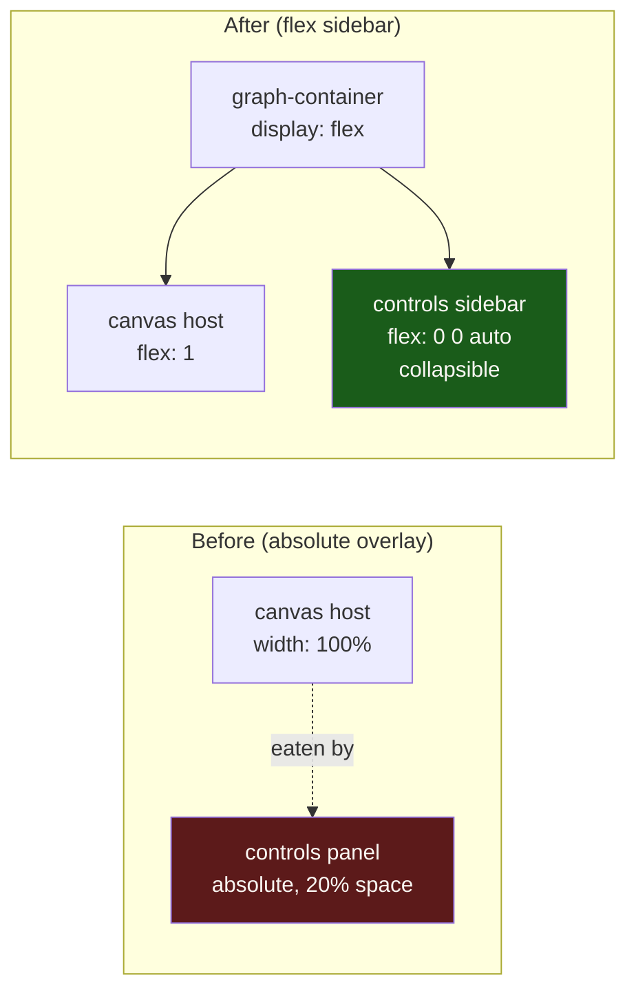
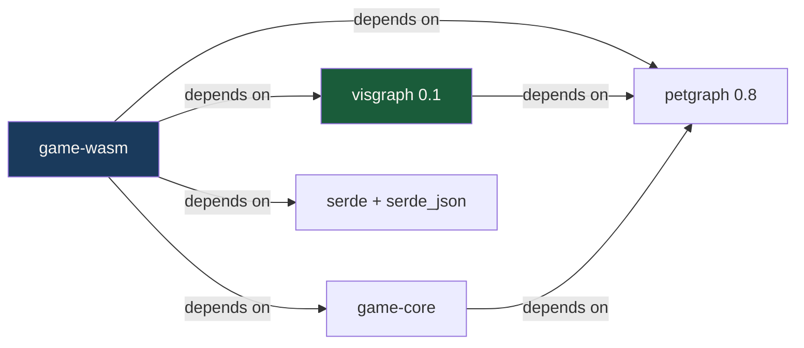
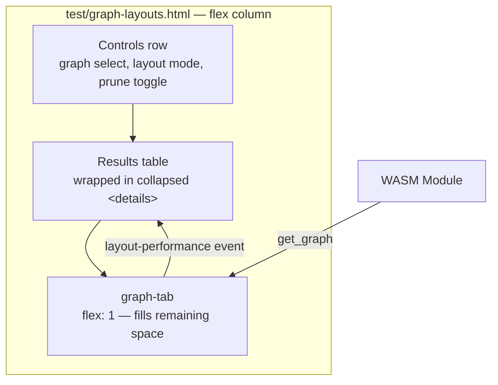

# Design: WASM Graph Layout + GraphLayout Class

## Architecture Overview



## Type Contract

Rust and TypeScript share a single JSON shape. Node layout is inline — no separate `Layout` type. WASM types reuse game-core's `EdgeKind` directly.

### JSON wire format (returned by `get_graph`)

```json
{
  "nodes": { "board:abc": { /* Board fields */, "x": 1.0, "y": 2.0 } },
  "edges": { "edge:0": { "from": "board:abc", "to": "board:def", "kind": {"Move":"Right"} } }
}
```

- Node positions `x` and `y` are optional — absent when no layout has been computed
- Both dagre and visgraph write positions directly into nodes — same shape regardless of engine
- `EdgeKind` is game-core's type, reused directly by WASM via serde

### Invariants

1. **Key format**: All node keys are `"board:{board_id}"`. All edge keys are `"edge:{edge_id}"`.
2. **Edge reference integrity**: Every `edge.from` and `edge.to` must exist as a key in `nodes`.
3. **fx/fy nullability**: `fx`/`fy` are `null` in fg-dag mode (free nodes), set to `x`/`y` values otherwise.
4. **Position optional**: `x`/`y` are absent when no layout has been computed (initial state, or fg-dag mode).

## Component Responsibilities



## Layout Dispatch Flow



## Edge Pruning

Standalone function in WASM. Not tied to layout mode — called by the consumer as needed.

### Why pruning?

fg-dag mode uses force-graph's built-in dag mode, which assumes a tree-like structure. Bidirectional edges (A→B and B→A) confuse the layout, creating visual overlap. Dagre handles cycles natively via its acyclic stage — no pruning needed.

### Algorithm

`prune_reverse_edges(graph_data: &mut GraphLayout)`:

For every pair of nodes (A, B):
1. If edge A→B exists AND edge B→A exists → keep A→B, remove B→A
2. If only one direction exists → keep it
3. If neither exists → no action

### WASM API

```rust
pub fn get_graph(prune_edges: bool, layout_mode: &str) -> String {
    let mut graph = build_graph(&game);
    if prune_edges {
        prune_reverse_edges(&mut graph);
    }
    if layout_mode == "visgraph" {
        apply_visgraph_layout(&mut graph);
    }
    serde_json::to_string(&graph).unwrap()
}
```

`apply_visgraph_layout` writes `x`/`y` directly into each node. For dagre, positions are computed client-side and written into the same fields. For fg-dag, nodes have no positions.

## JS ↔ WASM Data Flow



## GraphControls Layout



## Rust Crate Dependencies



## Benchmark Page

### Structure

The page is a single vertical flex column. The graph tab is last so it absorbs
all remaining space; the results table is collapsed by default so it does not
compete with the canvas for vertical room.



Sizing notes:

- The page container is `display: flex; flex-direction: column` with a viewport-based height
- `graph-tab` gets `flex: 1` and a `min-height` so the canvas is never collapsed to zero
- The results table is collapsible via `<details>`, closed by default
- The page keeps its own controls row even though `graph-tab` also renders a
  built-in `graph-controls` in its shadow root — accepted duplication for now,
  to be resolved once the page is stable

### Measurable Criteria

Each layout mode must meet these thresholds on the `.3` graph (8746 nodes, 9042 edges):

| Metric | Dagre | Visgraph | Force Dag |
|--------|-------|----------|-----------|
| Layout computation time | < 5000ms | < 500ms | 0ms (instant) |
| First render (nodes visible) | < 3000ms | < 1500ms | < 1000ms |
| Pan/zoom frame rate | >= 30fps | >= 30fps | >= 30fps |
| Memory (peak JS heap) | < 200MB | < 150MB | < 100MB |

### Pass/Fail Display

The benchmark page shows a pass/fail badge per metric:
- **Green**: meets threshold
- **Yellow**: within 1.5x threshold (needs optimization)
- **Red**: exceeds threshold (fails)

### What it does NOT measure

- Visual quality (subjective — side-by-side panels let users compare)
- Physics simulation time (irrelevant for layout modes)
- Initial WASM load time (one-time cost, not per-layout)

## Rust Side

### WASM types (`crates/wasm/src/types.rs`)

- `GraphLayout { nodes, edges }` — nodes contain `Board` + optional `x`/`y`, reuses `EdgeKind` from game-core
- `Node { board: Board, x: Option<f32>, y: Option<f32> }` — position set by visgraph, absent otherwise
- No separate `Layout` or `Point` types — positions live on the node

### WASM export

`get_graph(prune_edges: bool, layout_mode: &str) -> String`

- Builds `GraphLayout` from current game state
- If `prune_edges` is true, calls `prune_reverse_edges()`
- If `layout_mode` is `"visgraph"`, calls `apply_visgraph_layout()` which writes `x`/`y` into each node
- For dagre/fg-dag, nodes are returned without positions (computed client-side or not needed)

### Pruning (`crates/wasm/src/prune.rs`)

`prune_reverse_edges(graph: &mut GraphLayout)` — for every pair (A,B), if both A→B and B→A exist, remove B→A. Independent of layout mode.

## JS Side

### GraphLayout class (`src/components/GraphLayout.ts`)

- Single `_nodes: Map<string, Node>` where `Node = { board, x?, y? }` — no separate layout map
- `_edges: Map<string, Edge>` — edge data from WASM
- `update(wasmData)`: merges nodes (board + x,y), computes dagre if needed
- `setLayoutMode(mode)`: for fg-dag clears positions; for dagre/visgraph recomputes or uses WASM positions
- `toForceGraphData()`: derives `FgNode[]` (with fx/fy from x/y) and `FgLink[]` on demand
- No constructor required — created empty, populated by `update()`
- All layout methods private: `computeLayout`, `computeDagLayout`, `applyPositions`, `clearPositions`

### GraphTabElement — incremental updates

- Force-graph created once via `initForceGraph()`
- `graphData` setter calls `graphLayout.update()` then `syncForceGraph()`
- `layoutMode` setter calls `graphLayout.setLayoutMode()` then `syncForceGraph()`
- `syncForceGraph()` calls `forceGraph.graphData()` — diffed internally, no canvas teardown
- Camera position and zoom preserved across updates

## Key Decisions

1. **Node = board + optional position**: single map, no separate Layout type. `x`/`y` live on the node, absent when no layout computed.
2. **GraphLayout in wasm**: it's a serialization format, not domain logic
3. **Reuse game-core EdgeKind**: WASM types depend on game-core for domain types — no duplicate enums
4. **Same output shape for dagre and visgraph**: both write `x`/`y` into nodes — identical fields regardless of engine
5. **No constructor**: GraphLayout starts empty, populated by `update()`. Simpler lifecycle.
6. **GraphLayout class is testable**: no DOM, no force-graph dependency. Works directly with WASM JSON shape.
7. **GraphTab keeps DOM concerns**: force-graph instance, canvas rendering callbacks, hover cards, inspector, event listeners
8. **Single WASM call**: `get_graph(prune_edges, layout_mode)` returns graph data with positions inline on nodes
9. **Pruning is standalone**: `prune_reverse_edges` takes a boolean param, not tied to layout mode
10. **Incremental force-graph updates**: `graphData()` is called on existing instance, not destroy/recreate
11. **Measurable benchmark criteria**: layout time, render time, fps, memory with pass/fail badges

## Risks

- **WASM binary size**: visgraph adds ~50-100KB (needs verification)
- **Layout quality**: visgraph hierarchical may differ from dagre Sugiyama — benchmark page enables comparison
- **GraphLayout migration**: removing from game-core may break merge-cli or tui if they depend on it — check during implementation
- **Controls repositioning**: moving from absolute overlay to flex layout may affect responsive behavior on small screens
